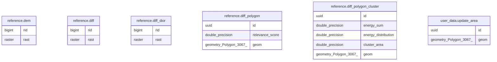

# job_template

## Tables

| Name | Columns | Comment | Type |
| ---- | ------- | ------- | ---- |
| [reference.dem](reference.dem.md) | 2 |  | BASE TABLE |
| [reference.diff](reference.diff.md) | 2 |  | BASE TABLE |
| [reference.diff_dior](reference.diff_dior.md) | 2 |  | BASE TABLE |
| [reference.diff_polygon](reference.diff_polygon.md) | 3 |  | BASE TABLE |
| [reference.diff_polygon_cluster](reference.diff_polygon_cluster.md) | 5 |  | BASE TABLE |
| [user_data.update_area](user_data.update_area.md) | 2 |  | BASE TABLE |

## Relations

---

> Generated by [tbls](https://github.com/k1LoW/tbls)
