# job_template

## Tables

| Name | Columns | Comment | Type |
| ---- | ------- | ------- | ---- |
| [reference.dem](reference.dem.md) | 2 |  | BASE TABLE |
| [reference.diff_gt_threshold](reference.diff_gt_threshold.md) | 2 |  | BASE TABLE |
| [reference.diff_lte_threshold](reference.diff_lte_threshold.md) | 2 |  | BASE TABLE |
| [reference.diff_polygon](reference.diff_polygon.md) | 4 |  | BASE TABLE |
| [reference.update_area_suggestion](reference.update_area_suggestion.md) | 6 |  | BASE TABLE |
| [user_data.update_area](user_data.update_area.md) | 5 |  | BASE TABLE |
| [reference.o_2_dem](reference.o_2_dem.md) | 2 |  | BASE TABLE |
| [reference.o_8_dem](reference.o_8_dem.md) | 2 |  | BASE TABLE |
| [reference.o_128_dem](reference.o_128_dem.md) | 2 |  | BASE TABLE |
| [reference.o_2_diff_gt_threshold](reference.o_2_diff_gt_threshold.md) | 2 |  | BASE TABLE |
| [reference.o_8_diff_gt_threshold](reference.o_8_diff_gt_threshold.md) | 2 |  | BASE TABLE |
| [reference.o_128_diff_gt_threshold](reference.o_128_diff_gt_threshold.md) | 2 |  | BASE TABLE |
| [reference.o_2_diff_lte_threshold](reference.o_2_diff_lte_threshold.md) | 2 |  | BASE TABLE |
| [reference.o_8_diff_lte_threshold](reference.o_8_diff_lte_threshold.md) | 2 |  | BASE TABLE |
| [reference.o_128_diff_lte_threshold](reference.o_128_diff_lte_threshold.md) | 2 |  | BASE TABLE |
| [user_data.dem_preview](user_data.dem_preview.md) | 2 |  | BASE TABLE |
| [user_data.o_2_dem_preview](user_data.o_2_dem_preview.md) | 2 |  | BASE TABLE |
| [user_data.o_8_dem_preview](user_data.o_8_dem_preview.md) | 2 |  | BASE TABLE |
| [user_data.o_128_dem_preview](user_data.o_128_dem_preview.md) | 2 |  | BASE TABLE |

## Stored procedures and functions

| Name | ReturnType | Arguments | Type |
| ---- | ------- | ------- | ---- |
| user_data.set_update_area_dirty | trigger |  | FUNCTION |

## Relations

```mermaid
erDiagram


"reference.dem" {
  bigint rid
  raster rast
}
"reference.diff_gt_threshold" {
  bigint rid
  raster rast
}
"reference.diff_lte_threshold" {
  bigint rid
  raster rast
}
"reference.diff_polygon" {
  uuid id
  double_precision relevance_score
  geometry_Polygon_3067_ geom
  double_precision energy_sum
}
"reference.update_area_suggestion" {
  uuid id
  double_precision energy_sum
  double_precision energy_distribution
  double_precision cluster_area
  geometry_Polygon_3067_ geom
  double_precision elevation
}
"user_data.update_area" {
  uuid id
  geometry_Polygon_3067_ geom
  boolean dirty
  double_precision elevation
  geometry_Polygon_3067_ dissolved_geom
}
"reference.o_2_dem" {
  bigint rid
  raster rast
}
"reference.o_8_dem" {
  bigint rid
  raster rast
}
"reference.o_128_dem" {
  bigint rid
  raster rast
}
"reference.o_2_diff_gt_threshold" {
  bigint rid
  raster rast
}
"reference.o_8_diff_gt_threshold" {
  bigint rid
  raster rast
}
"reference.o_128_diff_gt_threshold" {
  bigint rid
  raster rast
}
"reference.o_2_diff_lte_threshold" {
  bigint rid
  raster rast
}
"reference.o_8_diff_lte_threshold" {
  bigint rid
  raster rast
}
"reference.o_128_diff_lte_threshold" {
  bigint rid
  raster rast
}
"user_data.dem_preview" {
  bigint rid
  raster rast
}
"user_data.o_2_dem_preview" {
  bigint rid
  raster rast
}
"user_data.o_8_dem_preview" {
  bigint rid
  raster rast
}
"user_data.o_128_dem_preview" {
  bigint rid
  raster rast
}
```

---

> Generated by [tbls](https://github.com/k1LoW/tbls)
