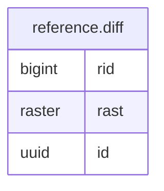

# reference.diff

## Columns

| Name | Type | Default | Nullable | Children | Parents | Comment |
| ---- | ---- | ------- | -------- | -------- | ------- | ------- |
| rid | bigint | nextval('reference.diff_rid_seq'::regclass) | false |  |  |  |
| rast | raster |  | false |  |  |  |
| id | uuid |  | false |  |  |  |

## Constraints

| Name | Type | Definition |
| ---- | ---- | ---------- |
| diff_pkey | PRIMARY KEY | PRIMARY KEY (rid, id) |

## Indexes

| Name | Definition |
| ---- | ---------- |
| diff_pkey | CREATE UNIQUE INDEX diff_pkey ON reference.diff USING btree (rid, id) |
| idx_diff_rast | CREATE INDEX idx_diff_rast ON reference.diff USING gist (st_convexhull(rast)) |

## Relations

---

> Generated by [tbls](https://github.com/k1LoW/tbls)
