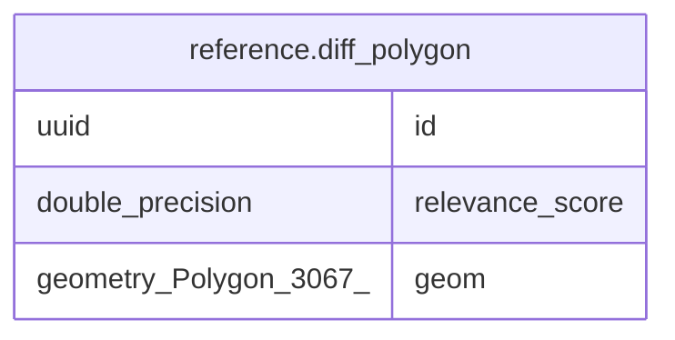

# reference.diff_polygon

## Columns

| Name | Type | Default | Nullable | Children | Parents | Comment |
| ---- | ---- | ------- | -------- | -------- | ------- | ------- |
| id | uuid |  | false |  |  |  |
| relevance_score | double precision |  | true |  |  |  |
| geom | geometry(Polygon,3067) |  | false |  |  |  |

## Constraints

| Name | Type | Definition |
| ---- | ---- | ---------- |
| diff_polygon_pkey | PRIMARY KEY | PRIMARY KEY (id) |

## Indexes

| Name | Definition |
| ---- | ---------- |
| diff_polygon_pkey | CREATE UNIQUE INDEX diff_polygon_pkey ON reference.diff_polygon USING btree (id) |
| idx_diff_polygon_geom | CREATE INDEX idx_diff_polygon_geom ON reference.diff_polygon USING gist (geom) |

## Relations

---

> Generated by [tbls](https://github.com/k1LoW/tbls)
