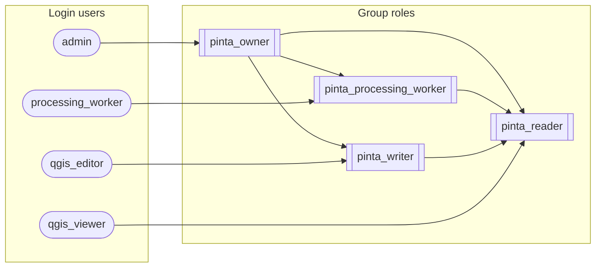

# Job DB roles & privileges

## Membership

## Database privileges (`job_template`)

| Role | Privileges |
| --- | --- |
| `pinta_owner` | CONNECT, TEMPORARY, CREATE |
| `pinta_processing_worker` | CONNECT, TEMPORARY |
| `pinta_reader` | CONNECT, TEMPORARY |
| `pinta_writer` | CONNECT, TEMPORARY |
| `admin` | CONNECT, TEMPORARY, CREATE |
| `processing_worker` | CONNECT, TEMPORARY |
| `qgis_editor` | CONNECT, TEMPORARY |
| `qgis_viewer` | CONNECT, TEMPORARY |

## Schema privileges

| Role | `alembic` | `public` | `reference` | `user_data` |
| --- | --- | --- | --- | --- |
| `pinta_owner` | USAGE, CREATE | USAGE, CREATE | USAGE, CREATE | USAGE, CREATE |
| `pinta_processing_worker` | — | USAGE | USAGE | USAGE |
| `pinta_reader` | — | USAGE | USAGE | USAGE |
| `pinta_writer` | — | USAGE | USAGE | USAGE |
| `admin` | USAGE, CREATE | USAGE, CREATE | USAGE, CREATE | USAGE, CREATE |
| `processing_worker` | — | USAGE | USAGE | USAGE |
| `qgis_editor` | — | USAGE | USAGE | USAGE |
| `qgis_viewer` | — | USAGE | USAGE | USAGE |

## Default table privileges

| Grantee | Schema | Owner | Privileges |
| --- | --- | --- | --- |
| `pinta_processing_worker` | `reference` | `pinta_owner` | SELECT, INSERT, UPDATE, DELETE, TRUNCATE |
| `pinta_processing_worker` | `user_data` | `pinta_owner` | SELECT, INSERT, UPDATE, DELETE, TRUNCATE |
| `pinta_reader` | `reference` | `pinta_owner` | SELECT |
| `pinta_reader` | `user_data` | `pinta_owner` | SELECT |
| `pinta_writer` | `reference` | `pinta_owner` | SELECT, INSERT, UPDATE, DELETE, TRUNCATE |
| `pinta_writer` | `user_data` | `pinta_owner` | SELECT, INSERT, UPDATE, DELETE, TRUNCATE |
