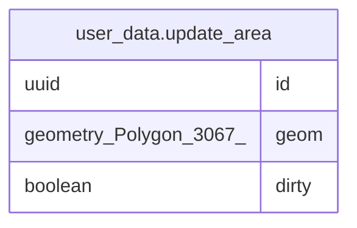

# user_data.update_area

## Columns

| Name | Type | Default | Nullable | Children | Parents | Comment |
| ---- | ---- | ------- | -------- | -------- | ------- | ------- |
| id | uuid |  | false |  |  |  |
| geom | geometry(Polygon,3067) |  | false |  |  |  |
| dirty | boolean | true | false |  |  |  |

## Constraints

| Name | Type | Definition |
| ---- | ---- | ---------- |
| update_area_pkey | PRIMARY KEY | PRIMARY KEY (id) |

## Indexes

| Name | Definition |
| ---- | ---------- |
| update_area_pkey | CREATE UNIQUE INDEX update_area_pkey ON user_data.update_area USING btree (id) |
| idx_update_area_geom | CREATE INDEX idx_update_area_geom ON user_data.update_area USING gist (geom) |

## Relations

---

> Generated by [tbls](https://github.com/k1LoW/tbls)
