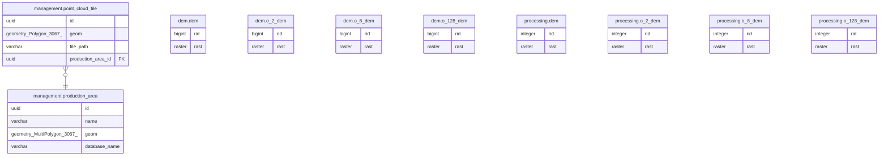

# pinta

## Tables

| Name | Columns | Comment | Type |
| ---- | ------- | ------- | ---- |
| [management.production_area](management.production_area.md) | 4 |  | BASE TABLE |
| [management.point_cloud_tile](management.point_cloud_tile.md) | 4 |  | BASE TABLE |
| [dem.dem](dem.dem.md) | 2 |  | BASE TABLE |
| [dem.o_2_dem](dem.o_2_dem.md) | 2 |  | BASE TABLE |
| [dem.o_8_dem](dem.o_8_dem.md) | 2 |  | BASE TABLE |
| [dem.o_128_dem](dem.o_128_dem.md) | 2 |  | BASE TABLE |
| [processing.dem](processing.dem.md) | 2 |  | BASE TABLE |
| [processing.o_2_dem](processing.o_2_dem.md) | 2 |  | BASE TABLE |
| [processing.o_8_dem](processing.o_8_dem.md) | 2 |  | BASE TABLE |
| [processing.o_128_dem](processing.o_128_dem.md) | 2 |  | BASE TABLE |

## Relations

---

> Generated by [tbls](https://github.com/k1LoW/tbls)
