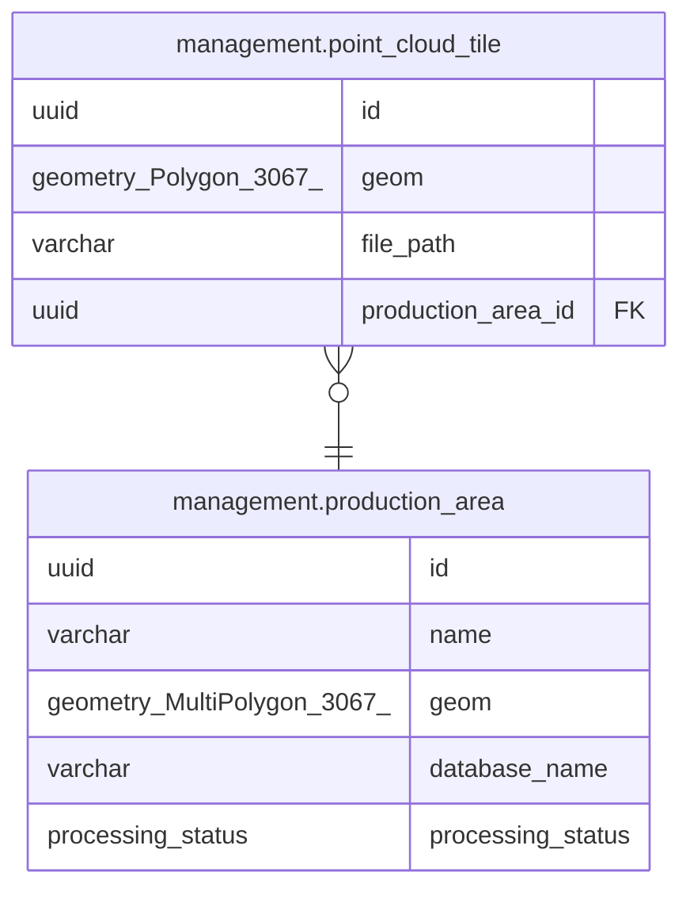

# management.point_cloud_tile

## Columns

| Name | Type | Default | Nullable | Children | Parents | Comment |
| ---- | ---- | ------- | -------- | -------- | ------- | ------- |
| id | uuid |  | false |  |  |  |
| geom | geometry(Polygon,3067) |  | false |  |  |  |
| file_path | varchar |  | false |  |  |  |
| production_area_id | uuid |  | false |  | [management.production_area](management.production_area.md) |  |

## Constraints

| Name | Type | Definition |
| ---- | ---- | ---------- |
| fk_point_cloud_tile_production_area_id_production_area | FOREIGN KEY | FOREIGN KEY (production_area_id) REFERENCES management.production_area(id) |
| pk_point_cloud_tile | PRIMARY KEY | PRIMARY KEY (id) |

## Indexes

| Name | Definition |
| ---- | ---------- |
| pk_point_cloud_tile | CREATE UNIQUE INDEX pk_point_cloud_tile ON management.point_cloud_tile USING btree (id) |
| idx_point_cloud_tile_geom | CREATE INDEX idx_point_cloud_tile_geom ON management.point_cloud_tile USING gist (geom) |

## Relations

---

> Generated by [tbls](https://github.com/k1LoW/tbls)
