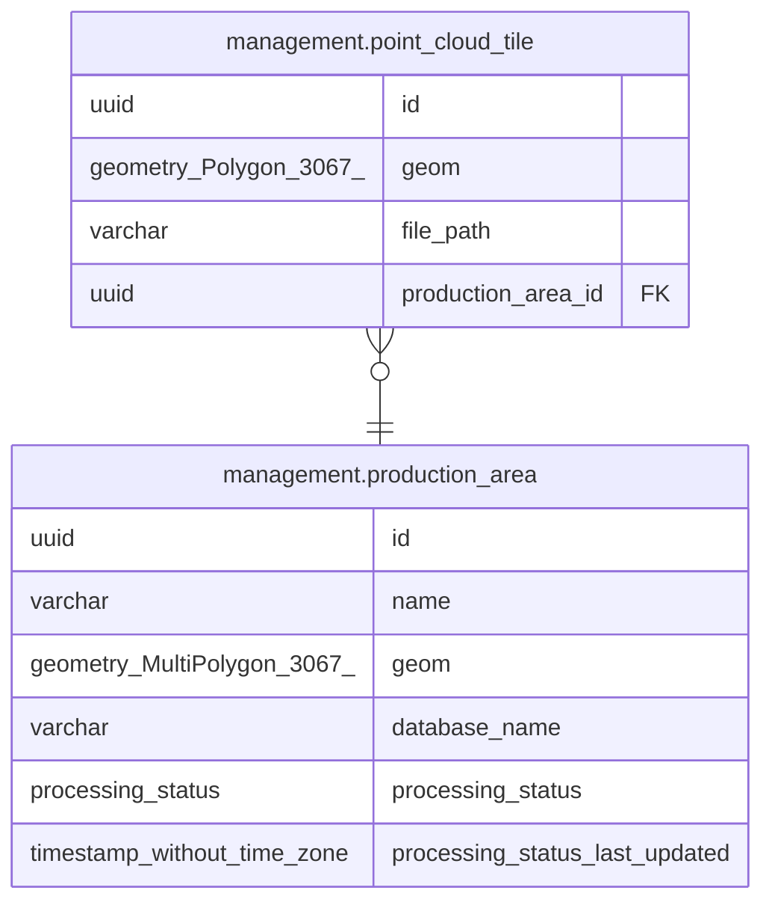

# management.production_area

## Columns

| Name | Type | Default | Nullable | Children | Parents | Comment |
| ---- | ---- | ------- | -------- | -------- | ------- | ------- |
| id | uuid |  | false | [management.point_cloud_tile](management.point_cloud_tile.md) |  |  |
| name | varchar |  | false |  |  |  |
| geom | geometry(MultiPolygon,3067) |  | false |  |  |  |
| database_name | varchar |  | true |  |  |  |
| processing_status | processing_status | 'not_started'::processing_status | false |  |  |  |
| processing_status_last_updated | timestamp without time zone |  | true |  |  |  |

## Constraints

| Name | Type | Definition |
| ---- | ---- | ---------- |
| pk_production_area | PRIMARY KEY | PRIMARY KEY (id) |

## Indexes

| Name | Definition |
| ---- | ---------- |
| pk_production_area | CREATE UNIQUE INDEX pk_production_area ON management.production_area USING btree (id) |
| idx_production_area_geom | CREATE INDEX idx_production_area_geom ON management.production_area USING gist (geom) |

## Triggers

| Name | Definition |
| ---- | ---------- |
| update_processing_timestamp_trigger | CREATE TRIGGER update_processing_timestamp_trigger BEFORE UPDATE ON management.production_area FOR EACH ROW EXECUTE FUNCTION management.update_processing_timestamp() |

## Relations

---

> Generated by [tbls](https://github.com/k1LoW/tbls)
