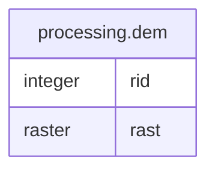

# processing.dem

## Columns

| Name | Type | Default | Nullable | Children | Parents | Comment |
| ---- | ---- | ------- | -------- | -------- | ------- | ------- |
| rid | integer | nextval('processing.dem_rid_seq'::regclass) | false |  |  |  |
| rast | raster |  | true |  |  |  |

## Constraints

| Name | Type | Definition |
| ---- | ---- | ---------- |
| dem_pkey | PRIMARY KEY | PRIMARY KEY (rid) |

## Indexes

| Name | Definition |
| ---- | ---------- |
| dem_pkey | CREATE UNIQUE INDEX dem_pkey ON processing.dem USING btree (rid) |

## Relations

---

> Generated by [tbls](https://github.com/k1LoW/tbls)
