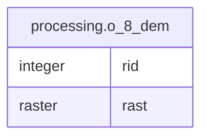

# processing.o_8_dem

## Columns

| Name | Type | Default | Nullable | Children | Parents | Comment |
| ---- | ---- | ------- | -------- | -------- | ------- | ------- |
| rid | integer | nextval('processing.o_8_dem_rid_seq'::regclass) | false |  |  |  |
| rast | raster |  | true |  |  |  |

## Constraints

| Name | Type | Definition |
| ---- | ---- | ---------- |
| enforce_height_rast | CHECK | CHECK ((st_height(rast) = 256)) |
| enforce_nodata_values_rast | CHECK | CHECK ((_raster_constraint_nodata_values(rast) = '{-9999.0000000000}'::numeric[])) |
| enforce_num_bands_rast | CHECK | CHECK ((st_numbands(rast) = 1)) |
| enforce_out_db_rast | CHECK | CHECK ((_raster_constraint_out_db(rast) = '{f}'::boolean[])) |
| enforce_pixel_types_rast | CHECK | CHECK ((_raster_constraint_pixel_types(rast) = '{32BF}'::text[])) |
| enforce_same_alignment_rast | CHECK | CHECK (st_samealignment(rast, '0100000000000000000000304000000000000030C0000000000024E4400000000004105E4100000000000000000000000000000000FB0B000001000100'::raster)) |
| enforce_scalex_rast | CHECK | CHECK ((round((st_scalex(rast))::numeric, 10) = round((16)::numeric, 10))) |
| enforce_scaley_rast | CHECK | CHECK ((round((st_scaley(rast))::numeric, 10) = round((- (16)::numeric), 10))) |
| enforce_srid_rast | CHECK | CHECK ((st_srid(rast) = 3067)) |
| enforce_width_rast | CHECK | CHECK ((st_width(rast) = 256)) |
| o_8_dem_pkey | PRIMARY KEY | PRIMARY KEY (rid) |

## Indexes

| Name | Definition |
| ---- | ---------- |
| o_8_dem_pkey | CREATE UNIQUE INDEX o_8_dem_pkey ON processing.o_8_dem USING btree (rid) |

## Relations

---

> Generated by [tbls](https://github.com/k1LoW/tbls)
