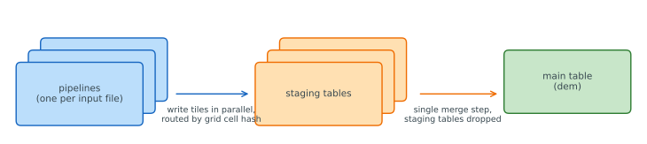
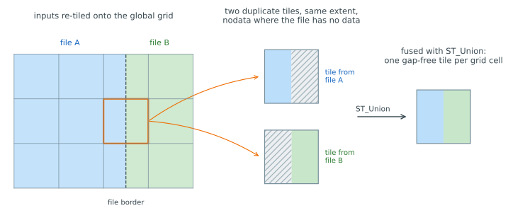
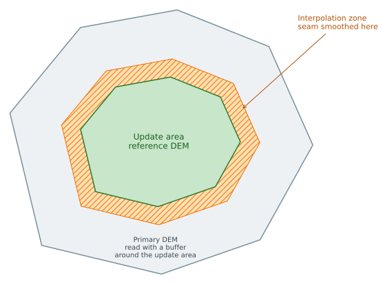
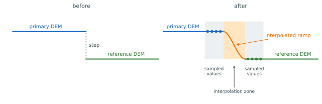

# Processing component

Running Python code from processing component:

* Build the container in project root: `docker compose build processing`
* Run code: `docker compose run --rm processing python -m pinta_processing.main` or `docker compose run --rm processing python src/pinta_processing/main.py`

## Table of contents

* [Parallel raster ingestion and staging tables](#parallel-raster-ingestion-and-staging-tables)
* [Dissolving update areas into the preview DEM](#dissolving-update-areas-into-the-preview-dem)
* [Pipelines](#pipelines)
* [LAZ processing with LAStools](#laz-processing-with-lastools)

## Parallel raster ingestion and staging tables

> **Note:** This section describes behaviour that spans the `processing`, [`db`](../db), and [`dags`](../dags) components. The raster writer lives here in `processing`, but the staging-table lifecycle (creation, merge, constraints) lives in the [`db`](../db/src/pinta_db_utils/postgis/raster.py) utilities and is orchestrated by the [`load_dem`](../dags/src/pinta_dags/dags/load_dem.py) and [`calculate_reference_dem`](../dags/src/pinta_dags/dags/calculate_reference_dem.py) DAGs. It is documented here for now because the processing pipeline is the natural entry point; it may move to the `db` or `dags` component later.

### Overview

Loading a DEM is parallel at the file level: each input file (a `.zip` raster for [`load_dem`](../dags/src/pinta_dags/dags/load_dem.py), or a LAS/LAZ tile rasterised with `blast2dem` for [`calculate_reference_dem`](../dags/src/pinta_dags/dags/calculate_reference_dem.py)) is handled by its own pipeline, and many pipelines run at the same time. Each pipeline reads its input, tiles the raster onto a fixed global grid, and writes those tiles to [PostGIS raster](https://postgis.net/docs/using_raster_dataman.html) storage.

Having every pipeline write directly into one shared raster table does not scale: concurrent writers serialise on shared, table-level resources (see below). Instead, each logical table (`dem` and its overviews) is backed by a number of short-lived **staging tables**. The parallel pipelines spread their tiles across the staging tables, and once they all finish, a single step **merges** the staging tables into the main table:



### Why staging tables? PostgreSQL pages, TOAST and write contention

PostgreSQL stores table data in fixed [8 KB pages](https://www.postgresql.org/docs/current/storage-page-layout.html), and a row must fit on a single page. When a value is larger than about a quarter of a page (~2 KB), PostgreSQL stores it out-of-line using [TOAST](https://www.postgresql.org/docs/current/storage-toast.html): the value is sliced into chunks held in a separate, table-private TOAST relation, and the row keeps only a pointer to them.

A raster tile is far larger than a page — a 256×256 `float32` block is 256 KB — so the raster column is always TOASTed. Writing a single tile therefore touches several physical structures at once: the table's own heap, its TOAST relation, and that relation's index.

When many pipelines write into the **same** table concurrently, they contend on those shared structures. The dominant cost is the *relation-extension lock*: only one backend at a time may append new pages to a given relation, and continuously growing both a table and its TOAST relation makes concurrent writers queue behind one another. A shared spatial index or uniqueness constraint on the raster column would serialise them further still.

Writing to several separate staging tables avoids this. Each staging table is its own relation with its own heap, TOAST relation, and extension lock, so spreading tiles across them splits the contention. Each tile is routed to a staging table by hashing its position on the global grid, which spreads tiles evenly.

### The global tile grid and file-edge duplicates

The writer does not store inputs as-is; it re-tiles every input onto a single **global grid** that is the same for all files, using a fixed tile size. For each grid cell an input overlaps, it produces one full tile, pre-filled with `nodata`, and copies in whatever part of the input falls inside that cell.

Snapping every file to the **same** global grid is what makes parallel ingestion mergeable: a given location always yields a tile with the exact same extent, no matter which file produced it.

At the **edges of an input file**, a grid cell is only partly covered. The tile for that cell holds real data over the covered part and `nodata` everywhere else. The neighbouring file covers the *other* part of the same cell and produces a tile at the **identical** extent — again `nodata` where it has no data. So along every shared border you get two overlapping duplicate tiles (and up to four at grid corners): same extent, complementary real data, `nodata` filling the gaps.

### Merging staging tables

Once every pipeline has finished writing, the staging tables are combined into the main table in a single step. All staging tiles are gathered together and grouped by their grid cell. Cells that occur only once are inserted directly. Cells that occur more than once (the duplicate edge tiles described above) are fused with PostGIS [`ST_Union`](https://postgis.net/docs/RT_ST_Union.html): where one copy has `nodata` and another has real data, the real data wins. The complementary halves of each border tile are merged back into a single, gap-free, continuous tile, leaving exactly **one tile per grid cell** in the main table.



With the data in place and every grid cell now unique, the spatial index and the [raster constraints](https://postgis.net/docs/RT_AddRasterConstraints.html) are added and the staging tables are dropped. Overviews of the DEM and are merged in the same way.

The merge itself is implemented in the [`db`](../db/src/pinta_db_utils/postgis/raster.py) component.

## Dissolving update areas into the preview DEM

> **Note:** Like raster ingestion above, this behaviour spans components: the pipeline and its stages live here in `processing`, while orchestration lives in the [`dissolve_update_areas`](../dags/src/pinta_dags/dags/dissolve_update_areas.py) DAG.

### What dissolving means

An **update area** is a polygon, digitized by the users themselves, inside which the newly calculated reference DEM should replace the primary DEM. Dissolving is the step that blends the two into the **DEM preview** (`dem_preview`): inside the update area the reference DEM is authoritative, outside it the primary DEM is kept, and the seam between them is smoothed by interpolation so the preview does not show a visible elevation step along the polygon border.



### The dissolve pipeline

[`pipelines.dissolve_update_area`](src/pinta_processing/pipelines.py) builds the following chain for one update area polygon:

```text
read primary DEM            read reference DEM
(around the update area)    (update area)
        │                        │
        └────────── Zip ─────────┘
                     │
                RasterUnion         (reference DEM wins inside the update area)
                     │
              RasterInterpolate     (smooth the seam)
                     │
      write dem_preview + overviews (merge into existing tiles)
```

The primary DEM is read as a ring around the update area so there is data around the seam to interpolate from, while the reference DEM is clipped to the update area itself. The update area interior is clipped out of the primary read: inside the area the reference DEM wins the union, and the seam interpolation samples its inner known points from the reference data, so primary data there would only be read to be overwritten. The ring width is derived from what the seam interpolation actually needs: the interpolation ring plus the known-point sampling band, plus a safety margin. [`RasterUnion`](src/pinta_processing/filters/union.py) lays both rasters onto a single grid, the reference DEM winning inside the update area, and [`RasterInterpolate`](src/pinta_processing/filters/interpolate.py) smooths the seam between the two surfaces (see below).

The blended patch and its downsampled overviews are then merged into `dem_preview`, re-tiled onto the same global grid used for ingestion: where a tile already exists its pixels are overwritten by the patch (existing values are kept where the patch has nodata). Overviews are visualization-only and downsampled from the blended patch alone, so concurrent dissolve tasks may leave a shared overview tile slightly stale, `dem_preview` itself stays consistent.

### Seam interpolation

After the union, the raster has an abrupt transition at the update area border: reference-DEM values inside meet primary-DEM values outside. To hide this step, the pipeline interpolates a donut-shaped zone *outside* of the polygon. The ring lies on the primary-DEM side because inside the area the reference DEM is authoritative and must not be altered.



The interpolated values are calculated by [`RasterInterpolate`](src/pinta_processing/filters/interpolate.py) as follows:

1. **Target pixels.** The ring polygon is rasterized onto the raster grid; every pixel whose *centre* falls inside the polygon becomes a target. These pixels' current values are discarded and recomputed.
2. **Known points.** The target mask is dilated by a few pixels in every direction (8-connected binary dilation). Pixels in this band that are not targets themselves and hold valid (non-nodata) data become the known points. This samples a narrow band of reference-DEM data on the inner side of the ring and primary-DEM data on the outer side, so the interpolation is anchored to both surfaces.
3. **Cubic interpolation.** The known points are fed to SciPy's `griddata` with `method="cubic"`, using pixel row/column indices as coordinates and elevations as values. SciPy triangulates the known points (Delaunay) and fits a piecewise-cubic [Clough–Tocher](https://docs.scipy.org/doc/scipy/reference/generated/scipy.interpolate.CloughTocher2DInterpolator.html) surface over the triangulation. The gradients used by the cubic patches are estimated so that the surface is **C1 continuous** — both the elevation and its slope vary smoothly across patch boundaries. Each target pixel's new value is this surface evaluated at the pixel's coordinates. The effect is a smooth ramp from the primary surface to the reference surface across the ring, with no kink at either edge.
4. **Write-back.** The interpolated values replace the target pixels; any remaining NaNs map back to nodata.

## Pipelines

The processing component provides a pipeline architecture for chaining raster and vector data processing operations together.

### Core Concepts

**Pipeline**: A chain of processing stages that execute sequentially. Each stage processes raster or vector data and passes the result to the next stage or returns the data as pipeline output.

**Stage**: A processing operation that implements the `process(data)` method. Stages receive a `RasterDataset` or `VectorDataset` (or `None`), perform an operation, and return the result.

**RasterDataset**: A container for raster data consisting of:

* `array`: NumPy array containing the raster values
* `transform`: Affine transformation for georeferencing
* `crs`: Coordinate Reference System
* `nodata`: Nodata value

### Creating Pipelines

Pipelines are created using the pipe operator (`|`) to chain stages together:

```python
from pinta_processing import reader, writer, filters

# Simple read-transform-write pipeline
pipeline = reader.RasterioReader("input.tif") \
    | filters.MultiplyValues(factor=2.0) \
    | writer.GeotiffWriter("output.tif")

# Execute pipeline (read-only stages like reader return data)
pipeline.execute()
```

Example of pipeline returning raster data:

```python
from pinta_processing import reader, writer, filters

# Simple read-transform-write pipeline
pipeline = reader.RasterioReader("input.tif") \
    | filter.MultiplyValues(factor=2.0)

# Execute pipeline (read-only stages like reader return data)
result = pipeline.execute()
# Get raster pixels as np array
result.array
```

### Pipeline Modules

#### Reader

The `reader` module handles loading raster or vector data for various sources.

`PostgisReader` clips a raster table with a WKT geometry. The intersecting tiles are clipped and streamed out of the database **one row at a time** and mosaicked client-side. The backend never materializes the full clipped raster. Unioning the tiles server-side instead would build the whole clipped raster in backend memory as a single value, which for large clip geometries leads to backend out-of-memory failures.

#### Filter

The `filters` module contains data transformation stages that modify data while preserving metadata.

#### Writer

The `writer` module handles saving data to various medias. All writer stages behave as sinks; no data is returned from a writer, and the pipeline branch does not continue after a writer stage.

#### Tee

The `Tee` stage branches a pipeline into multiple parallel paths without affecting the main data stream:

```python
from pinta_processing import core, reader, filters, writer

# Create a branching pipeline where data goes to multiple writers
pipeline = (
    reader.RasterioReader("dem.asc")
    | core.Tee(
        filters.MultiplyValues(2.0)
        | writer.GeotiffWriter("dem_multiplied.tif")
    )
    | writer.GeotiffWriter("dem.tif")
)

pipeline.execute()
```

Each branch receives an independent copy of the data, allowing simultaneous write operations without interference. The main data stream continues unchanged after the Tee.

#### Zip

The [`Zip`](src/pinta_processing/core.py) stage is the inverse of [`Tee`](src/pinta_processing/core.py): instead of fanning one stream out to several branches, it gathers several streams back into one. It runs one or more independent branches and combines their outputs with the main data stream into a single tuple, which is passed to the next stage. This lets a downstream stage work on several inputs at once — for example, differencing two rasters.

The main stream value, if present, becomes the first element of the tuple, followed by each branch result in order. Each branch is independent and is typically a self-contained sub-pipeline that starts with its own reader.

```python
from pinta_processing import core, reader, filters, writer

# Compute the elevation change between two DEMs.
# The main stream reads the newer DEM, Zip pulls in the older one, and
# RasterDiff receives the (newer, older) tuple and subtracts the second
# from the first.
pipeline = (
    reader.RasterioReader("dem_2026.tif")
    | core.Zip(reader.RasterioReader("dem_2020.tif"))
    | filters.RasterDiff()
    | writer.GeotiffWriter("dem_change.tif")
)

pipeline.execute()
```

`Zip` accepts multiple branches, producing a longer tuple. It can also be used as the first stage of a pipeline (with no main stream), in which case the tuple contains only the branch results:

```python
from pinta_processing import core, reader, filters, writer

# Zip as the first stage: the tuple holds only the branch outputs.
pipeline = (
    core.Zip(
        reader.RasterioReader("dem_2026.tif"),
        reader.RasterioReader("dem_2020.tif"),
    )
    | filters.RasterDiff()
    | writer.GeotiffWriter("dem_change.tif")
)

pipeline.execute()
```

Consumers such as [`RasterDiff`](src/pinta_processing/filters/diff.py) require the zipped rasters to share an identical shape, CRS, and transform.

## LAZ processing with LAStools

Point cloud (LAS/LAZ) tiles are rasterised into a DEM with [LAStools](https://rapidlasso.de/lastools/). [`Blast2DemReader`](src/pinta_processing/reader/lastools.py) runs the tool as a subprocess, writes a temporary GeoTIFF and hands it back into the pipeline as a normal `RasterDataset`, so LAStools appears as an ordinary reader stage.

**The binaries are not baked into the processing image.** The image build only *verifies* that the shared libraries LAStools needs are present. At run time the binaries come from a bind mount, so the container expects to find lastools executables from configured path.

### Setting up LAStools on a server, with a license

1. Unpack the LAStools distribution somewhere on the Docker host, so that `<dir>/bin/las2dem_new64` exists.
2. Set the Airflow Variable `pinta_lastools_path` to that host directory. It is bind-mounted read-only into every container task at `/lastools` (see [`config.py`](../dags/src/pinta_dags/config.py)).
3. Make the license file reachable, in one of two ways:
   * Place `lastoolslicense.txt` inside the LAStools directory. The default `LAStoolsLicenseFile=/lastools/lastoolslicense.txt` then finds it with no further configuration.
   * Or set the Airflow Variable `pinta_lastools_license_path` to the host path of the license file. It is mounted at `/lastoolslicense.txt` and `LAStoolsLicenseFile` is repointed there.

### Demo mode for local development

Without a license the binaries only run when invoked with `-demo` flag. When `LASTOOLS_DEMO_MODE` environment variable is truthy lastools will run in [demo mode](https://rapidlasso.de/lastools-test-and-validate-in-demo-mode/).

Locally the flag comes from the Airflow Variable `pinta_lastools_demo_mode`, which is templated into the task container's environment. In the dev stack it is wired through `AIRFLOW_VAR_PINTA_LASTOOLS_DEMO_MODE` in [docker-compose.yml](../../docker-compose.yml) and defaults to `false`, so set it in your `.env` to run unlicensed. Leave it off on a licensed server — the restricted output is only acceptable for development and tests.
